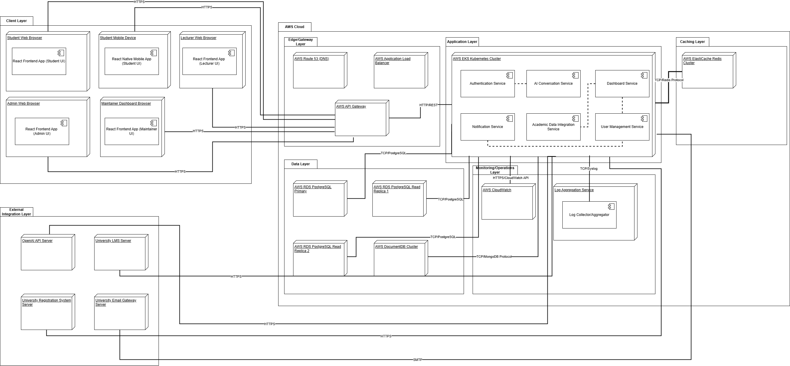

# Deployment Architecture
### Click on the diagram for better visibility.

| Element                     | Description                                                             | Domain Role                         |
|-----------------------------|-------------------------------------------------------------------------|-------------------------------------|
| AI Core Server              | Hosts the main AI engine handling queries, analytics, and API calls.     | Central computation, data analytics |
| Student Client (Web/App)    | User-facing interface for students to access assistant features.         | Interactive access node             |
| Faculty/Admin Dashboard     | Interface used by faculty/admins for content management and analytics.   | Institutional management portal     |
| LMS Connector               | Middleware bridging AI Core and the Learning Management System (LMS).    | Data integration                    |
| Registration API            | Communicates with university registration services for student/advisor.  | External system integration         |
| Calendar Sync Service       | Connects and synchronizes institutional calendars and event data.        | Event scheduling connector          |
| Email Gateway               | Handles outbound/inbound emails for notification and content delivery.   | Messaging                       |
| External Data Source Node   | APIs/services for external analytics (grades, attendance, etc.).         | Third-party data fetcher            |
| Monitoring/Logging Service  | Collects performance, health, and security logs.                         | Reliability/quality infrastructure  |
| Institutional Network       | Secures all internal communication between servers and clients.          | Secure transport layer              |

