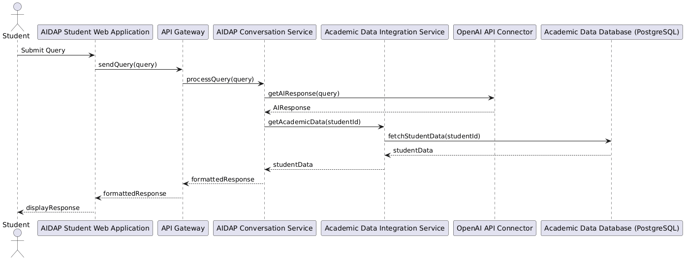

# Sequence Diagrams

This section details the main sequence for a student query—from UI to AI assistant, with data integration—per course rubric and repo architecture.

## Sequence Diagram

---

## Sequence Diagram Methods Table

| Component                       | Method / Interface                | Description                                       |
|----------------------------------|-----------------------------------|---------------------------------------------------|
| AIDAP Student Web Application    | sendQuery(query)                  | Sends student's query to the backend via API Gateway. |
| API Gateway                     | processQuery(query)                | Routes incoming query to Conversation Service.     |
| AIDAP Conversation Service       | getAIResponse(query)               | Invokes external AI response via connector.        |
| AIDAP Conversation Service       | getAcademicData(studentId)         | Requests academic data for this student from integration service. |
| Academic Data Integration Service| fetchStudentData(studentId)        | Gets academic record from the database.            |
| OpenAI API Connector            | getAIResponse(query)               | Returns the AI-generated response for query.       |
| Academic Data Database (PostgreSQL) | fetchStudentData(studentId)       | Table query to retrieve student data.              |
| AIDAP Student Web Application    | displayResponse                    | Shows formatted reply to student in the UI.        |
